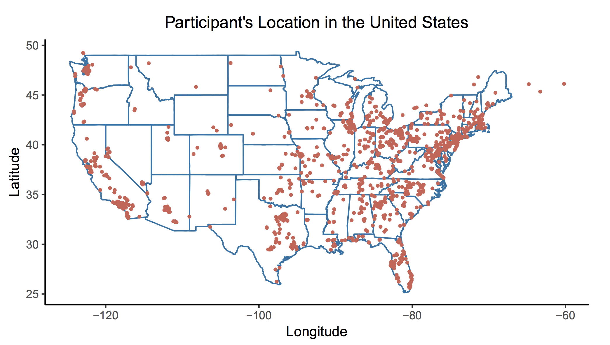
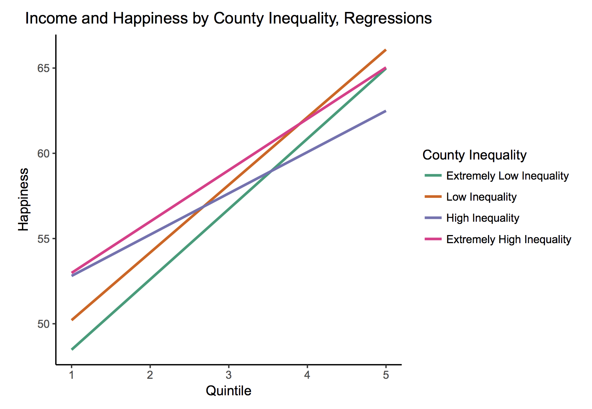
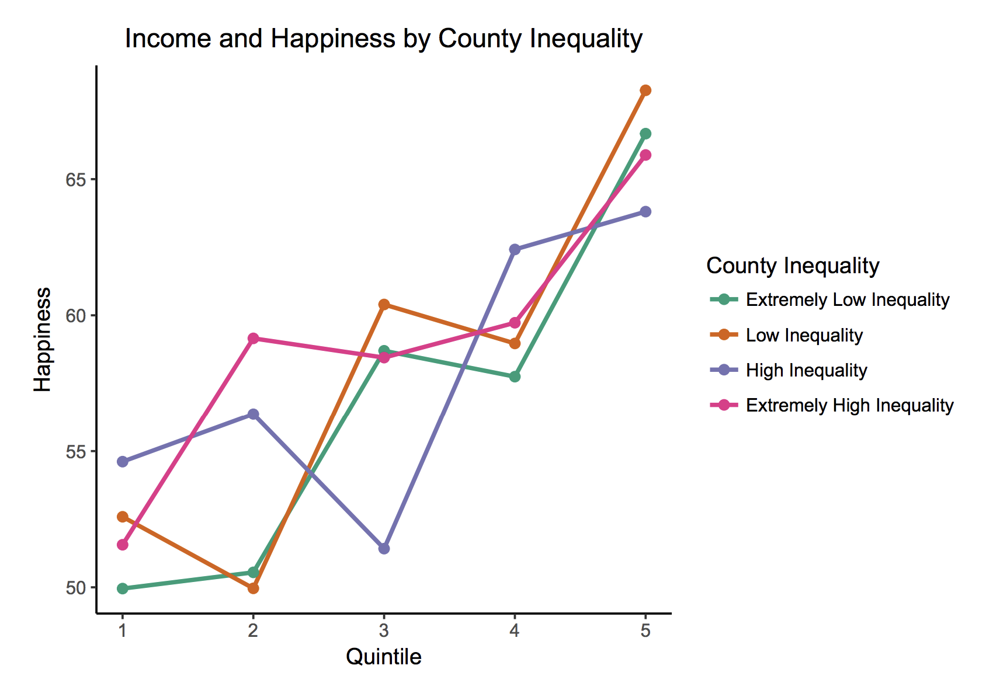
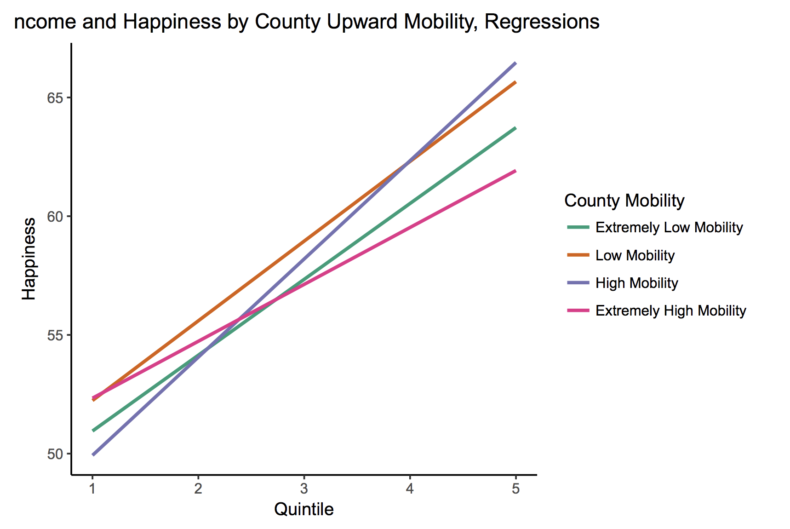
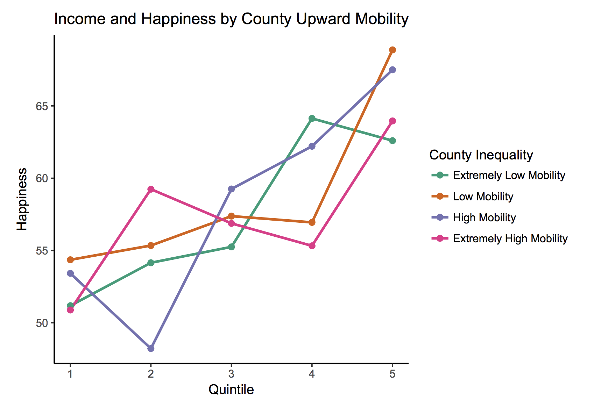

+++
# Date this page was created.
date = 2018-10-05T00:00:00
highlight = true

# Project title.
title = "Does High Economic Inequality, and Low Economic Mobility Threaten, the Relationship Between Income and Happiness?"

# Project summary to display on homepage.
summary = "Multilevel modeling exploring how county level inequality/mobility impacts the relationship between money and happiness"

# Optional image to display on homepage (relative to `static/img/` folder).
#image_preview = "/Mobility_happiness/mobility.jpg"

# Tags: can be used for filtering projects.
# Example: `tags = ["machine-learning", "deep-learning"]`
tags = ["Data Viz", "multilevel modeling", "ggplot2"]

# Optional external URL for project (replaces project detail page).
external_link = ""

# Does the project detail page use math formatting?
math = false

# Optional featured image (relative to `static/img/` folder).
[header]
#image = "/Mobility_happiness/gini_county.png"
#caption = "Inequality by U.S. County"

+++

Myriad past research demonstrates a fairly strong link between money and happiness. That is, people are generally happier when they make more money up to around the $75,000 a year mark [(e.g., Kahneman & Deaton, 2010)](http://www.pnas.org/content/pnas/107/38/16489.full.pdf). However, one possible threat to this relationship is the level of economic inequality. Really, one could imagine this relationship going in either directions. On one hand, it seems intuitive that money has more happiness purchasing-power when your immediate community is highly unequal. In this case, having a lot of money could make you more satisfied to have 'made it.' On the other hand, it could be extremely uncomfortable to be on the top of the economic ladder when poverty is so readily apparent.

I tested this question with a set of multilevel models using four different datasets, which can be found [here](https://github.com/dwiwad/Inequality-Mobility-Income-and-Happiness/tree/master/Data):

**survey_data.csv**; This dataset contains 1,441 survey responses from two qualtrics national panels. The key individual variables here are happiness, economic quintile, age, political ideology, and location (latitude and longitude). We collected these data in our lab as part of larger projects exploring the psychological correlates of perceived economic mobility.

**ACS_14_5YR_B19083**; this dataset is from the United States census and contains two county identifiers (FIPS code and county name), income inequality (Gini) for each county, and the standard error for each Gini coefficient.

**gini.by.state**; this dataset is also from the United States census and contains two state identifiers (FIPS code and state name), income inequality (Gini) for each state, and the standard error for each Gini coefficient.

**mobility.by.county**; this dataset is from the Harvard Mobility Project and contains a measure of income mobility, as well as various population demographics, for each county. The measure I will be using, absolute upward mobility, quantifies the average income percentile for a child whose parents were in the 25th percentile. So, for example, if a county has an absolute upward mobility value of 40 this means that the children of parents who were in the 25th percentile of the income distribution ended up, on average, in the 40th percentile.

So, some of the data was data we had collected in the past and some of the data came from established sources. The first thing I did was take a quick look at where our participants were in the United  States.

So, we can see that the participants are pretty spread out across the United States, with a bit of a dearth in the central United States; most participants seem to be in the Eastern U.S. I used this geolocation data to assign each participant the county in which they live. I will spare you the nitty-gritty details of the multilevel modeling, but if you are so inclined you can find everything [here](https://github.com/dwiwad/Inequality-Mobility-Income-and-Happiness/blob/master/Markdown%20Docs/MLM_Comprehensive_Exam.pdf).

What I found was that, in line with past research, personal income (as measured by which income quintile the person reports being in) was a very strong predictor of happiness. In accounting for all the individual (age, gender, political ideology) and county-level (inequality) factors, it income was the only significant determinant of happiness. While I didn't observe a significant interaction between income and happiness, suggesting that there could be a relationship here. But what does that relationship actually look like?

In order to take a look at this, I did a quartile split on income inequality and binned participants into four categories: extremely low inequality (gini less than .43), low inequality (gini between .43 and .45), high inequality (gini more than .45 and less than.48), and very  high inequality (gini more than .48). Then, I plotted out the simple relationshp between income quintile and happiness in each of these inequality categories.

What you can see here pretty clearly is that the slope of the relationship in counties with less inequality (the green and orange lines) is steeper than in counties with more inequality (the purple and pink lines). That is to say, money seems to have more "happiness purchasing power" when people live in more equal communities. Just to look at this in another way, here are the data plotted as actual means instead of over simplified regression lines.

The above presented data show that the increase we get in happiness from having more money is diminished in places with higher inequality. One possible reason for this is simply exposure to inequality through poverty. Looking only at the people who reported being in the fifth quintile, you can see that happiness is the lowest in the high and extremely high inequality places. It’s possible that in these places the high income people are exposed to more poverty, and thus feel an increased sense of wealth guilt, leading to a dampened general happiness.

This is only one possible explanation and uncovering the mechanism here requires significant further exploration. For now, I’m going to just explore the data again, this time looking at the level of absolute upward mobility present in a county, instead of inequality.

## Income and Happiness by County Upward Mobility

One might suspect an interaction here such that the relationship between income and happiness is stronger in places with low mobility, perhaps as a sort of dissonance mechanism. That is, when one cannot move up the income ladder they rationalize and are thus happier with their level of income, regardless. Specifically, I would think that high income people are equally happy regardless of the level of mobility, but as mobility drops the baseline level of happiness for those in lower quintiles rises. Same with the previous analysis, I'm going to spare you all the nitty-gritty modeling details here and just present the main trends.

This actually doesnt look all that different from the inequality version of the graph, but here there is no interaction whatsoever. The slopes are all equal. Let’s take a quick look at the graph of the actual data, instead of the regression lines:

Looking at this graph versus the graph with county inequality makes it clear there really is no interaction here, just as the MLM data show. These models suggest that the relationship between income and happiness may indeed be influenced by the level of inequality present in the county one lives. Specifically, income has greater happiness purchasing power when you live in a more equal society. Perhaps this is due to the decreased availability of visible poverty and inequality, leading to a lower sense of wealth guilt among those living in the higher quintiles. On the other hand, it is also possible that in areas with lower inequality do not suffer so much from the middle class being washed out, thus having a higher income means one’s purchasing power is higher and can live relatively better off compared with someone of the same income bracket in a high-inequality city, where their money potentiall has less purchasing power.

## Conclusion

In sum, across this analysis I: (a) cleaned and combined four separate datasets into one useable dataset with individual and county level information, (b) ran a series of multilevel models exploring the interaction of county-level data and individual level relationships, and (C) unpacked these interactions with concise data visualization. Within the analyses, I first replicated a long-standing effect showing that higher wealth is related to higher happiness, overall. I then built upon this, showing that there appears to be a modest interaction between the level of inequality where one lives and the strength of the money-happiness relationship. Particularly, it appears that the happiness-purchasing power of money is greater when one lives in a more equal county. Lastly, I found that the level of absolute upward mobility in a county does not change the nature of the money-happiness relationship
