+++
# Date this page was created.
date = 2022-03-18T00:00:00
highlight = true

# Project title.
title = "Why are Tinder App Store Ratings Declining?"

# Project summary to display on homepage.
summary = "In this analysis I use Natural Language Processing to understand why Tinder has experienced two ratings declines between 2013 and 2022"

# Optional image to display on homepage (relative to `static/img/` folder).
image_preview = ""

# Tags: can be used for filtering projects.
# Example: `tags = ["machine-learning", "deep-learning"]`
tags = ["Data Viz", "Natural Language Processing", "User Experience", "Panel Data", "Linear Regression", "Multilevel Modeling"]

# Optional external URL for project (replaces project detail page).
external_link = ""

# Does the project detail page use math formatting?
math = false

# Optional featured image (relative to `static/img/` folder).
[header]
#image = "3.tinder_rating_time_ci.png"
caption = "Eddy Merckx, The GOAT?"

+++

## Highlights

- Tinder App Store ratings declined 42% Between 2013 and 2022 in two waves.
- I analyzed 7.8 Million words left across 525,000 reviews to find out why.
- First decline: related to to higher user complaints about Bugs and Spam (e.g., fake users).
- Second decline: related only to higher complaints of Spam as the app became more stable
- Tinder should enact more stringent controls on fake users to increase user engagement, sentiment, and retention

## Executive Summary: 

Between 2013 and 2022 Tinder app ratings on the Google Play store have fallen 42% From a peak of 4.05 (out of 5) in October 2014 to 2.35 (out of 5) as of February 2022. This occurred over two steady declines; ratings declined between July 16, 2013 and September 24, 2015, recovered partially, and then declined again between October 14, 2018 and January 13, 2021. To explore why, I analyzed 525,294 written reviews (approximately 7.8 million words) using Natural Language Processing techniques (e.g., term-document frequencies, sentiment analysis, and word embeddings) and ordinary piecewise and linear regression. I find that the eight-year decline in Tinder ratings coincides with 50% increase in negative review content (compared with only a 41% decrease in positive review content). More specifically, complaints of both ‘fake’ users (e.g., bots, scammers, etc) and bugs (e.g., crashing, freezing, etc) predict Tinder’s initial ratings decline. However, only complaints surrounding fake users—but not bugs—predicts Tinder’s second more recent decline in ratings. These data suggest that, while they have sufficiently stabilized the app, the organization still needs to enact more stringent controls on ‘fake’ users in order to increase engagement, usage, sentiment, and retention. All R code for this project can be found [here](https://github.com/dwiwad/Tinder_Trends).

## Context

I was interested in exploring some data regarding how engagement with a mobile application changes over time and I found [this](https://www.kaggle.com/sidharthkriplani/datingappreviews) dataset containing 681,993 dating app reviews for Tinder, Bumble, and Hinge spanning 2013 to 2022. It’s a very bare-bones dataset containing only the user’s name, their plain-text review, their numeric star rating of the app (coded numerically as 1 to 5 corresponding to the number of stars), the number of “thumbs up” endorsements that the review got, the date of the review, and the app name. See the end of this post for detailed methodological detail.

I was immediately curious about how ratings of the apps, in particular Tinder, have changed over time and what elements from the natural language data predict this change. As you can see below, the vast majority—77%—of the ratings are for Tinder. Further, Tinder had much faster growth settling around 60,000 – 70,000 reviews per year, compared with less than 25,000 per year for Hinge and Bumble.

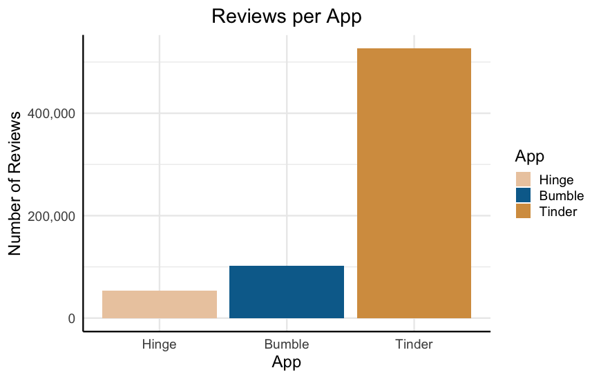
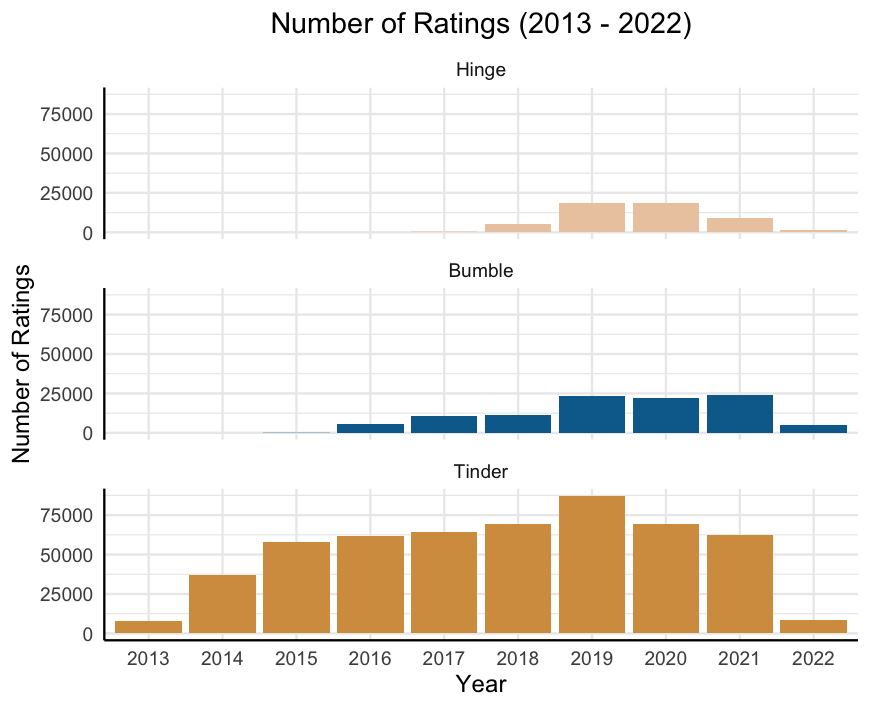

Given this, I decided to focus solely on exploring the trajectory of the 526,615 Tinder ratings. I explored two key questions:

1.	How are Tinder app ratings changing over time?
2.	If they are changing, why is that happening?

## How are Tinder App Ratings Changing Over Time?

Since its peak of 4.05 in October 2014 Tinder ratings have been steadily declining to its current position of 2.35 as of February 2022. This is 42% drop in average rating over the app’s 8-year life span. 

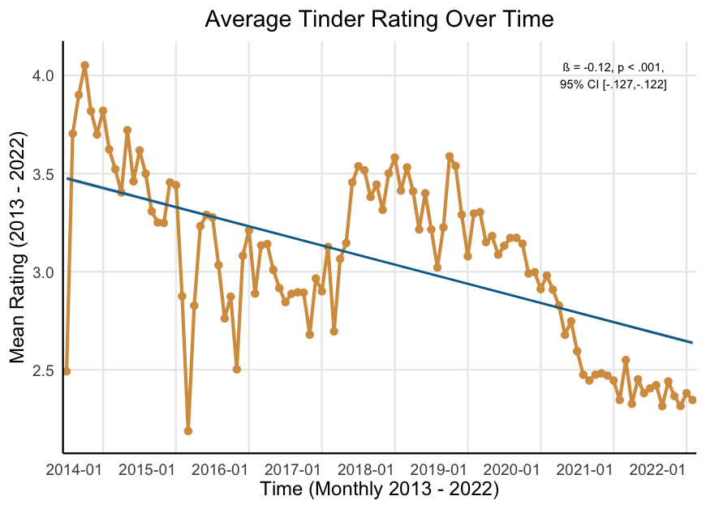

Additionally, we see that this decline came in two waves. Ratings declined until late 2016, recovered slightly, and then declined sharply over 2019 and 2020, finally settling to its current low point. 

I used a simple linear regression method to quantify exactly how much ratings have declined over the last eight years. The standardized effect size from this regression was ß = -.12. While this may not seem like a ‘huge’ effect, it is worth noting that this is equivalent to the impact of being deployed to Vietnam on the development of PTSD, or the effect of an oral antihistamine on reduced sneezing.

Clearly ratings having been declining over time in two predictable stages. In order to more concretely define these declines, I used a piecewise linear regression. This analysis extracts inflection points (“breakpoints”) at which the linear trend changes. Given my subjective assessment of four “phases” to the trend—initial decline, recovery, secondary decline, final low—I specified three breakpoints. Table 1 includes the model-defined start and end points for each phase of the ratings trend (See methods for full analysis).

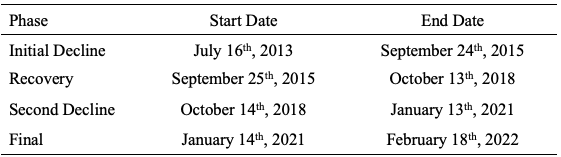

Now we turn to the actual text reviews—do they provide clues as to why these declines occurred?

## Why are Ratings Declining Over Time?

There are many ways to test this question. For the sake of brevity, I will focus on two elements of the reviews: emotional language and content analysis (e.g., what themes are present in the reviews). First, I am going to explore whether reviews are becoming (a) less positive, (b) more negative, or (c) both. Secondly, I will dig into the content of the negative words to explore any potential themes.

I first pre-processed the raw text reviews to put it in a more usable format. Initially, the text contained 7,864,944 individual words (<em>Mrev</em> = 14.93, <em>Medrev</em> = 7, <em>SD</em> = 19.47 words) spread across 526,615 reviews. However, many reviews were either not in English or contained non-text elements (e.g., emojis). Additionally, it is important to remove stopwords (e.g., the, at, for)—words that are extremely frequent but are not meaningful. Following the removal of all stopwords and non-English text, I was left with a corpus of 4,383,647 words (<em>Mrev</em> = 8.32, <em>Medrev</em> = 4, <em>SD</em> = 10.25 words) across 520,929 reviews.

### Emotion Content

First, for each review I simply computed the number of both positive (e.g., great, nice, fun) and negative (e.g., bad, stupid, boring). Following this, I computed the term-review frequency by computing the proportion of words in each review that were positive and negative. For example, if a review contained 10 words total and 4 were negative and 2 were positive the term-review frequencies are 0.40 and 0.20 for positive and negative words, respectively.

As can be seen below, we see that over time reviews became both less positive (<em>ß</em> = -.017, <em>p</em> < .001, 95% CI [-.020, -.014]) and more negative (<em>ß</em> = .052, <em>p</em> < .001, 95% CI [.049, .055]). Crucially, the increase in negative content outpaced the decrease in positive content. Specifically, while there was a 41% decrease in positive content, there was 50% increase in negative content.

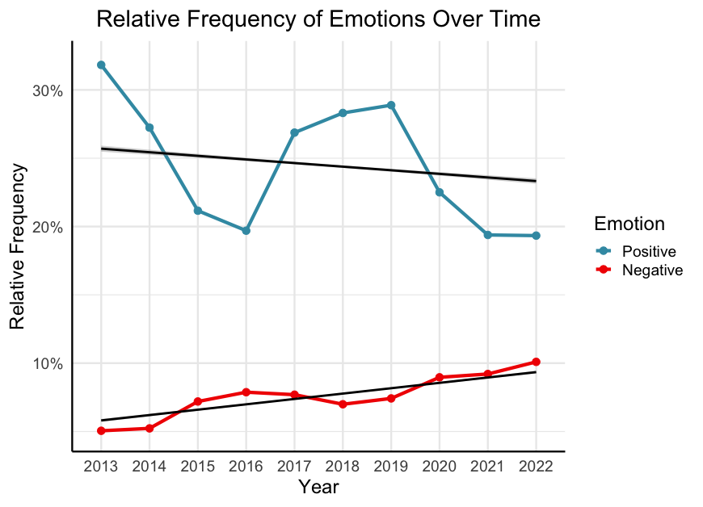

Given that negative content is outpacing positive content, this is where I focused the final piece of my search—what exactly is it that users are complaining about? Is it something that could be addressed by the developers?

In order to do this, I calculated how frequently each negative word occurs in the entire body of 308,729 unique words irrespective of when the review was left. I first computed the frequency of every individual word in the review text and then performed a sentiment analysis to classify each word as positive or negative.

The most frequent negative word, occurring 18,353 times (5.94% of all negative words) is the word ‘fake.’ Another interesting element here is that a handful of these top 20 words pertain to bugs in the software—crashes, issues, bugs, etc.

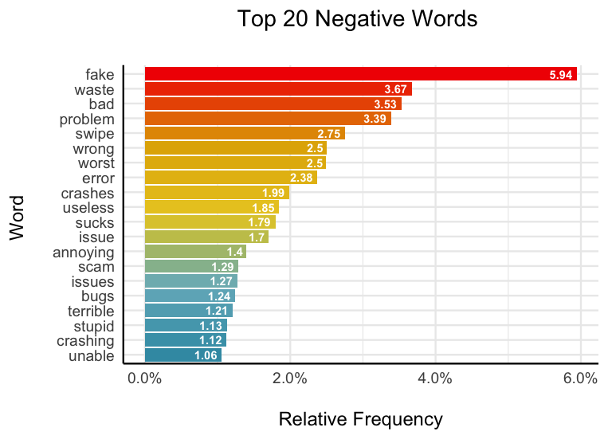

There are two main themes that occur in these top 20 words: fake users and software errors. When looking at these two terms (‘fake’ and ‘errors’) we see that over time, complaints of fake users (across all reviews) have nearly tripled since 2013 (<em>ß</em> = .745, <em>p</em> < .001, 95% CI [.614, .876]) and reports of crashes have actually decreased overall (especially since 2019; <em>ß</em> = -.270, <em>p</em> < .001, 95% CI [-.458, -.080]). In fact, notice that January 2019 is when these two lines seriously diverge—the same time that ratings begin their second freefall.

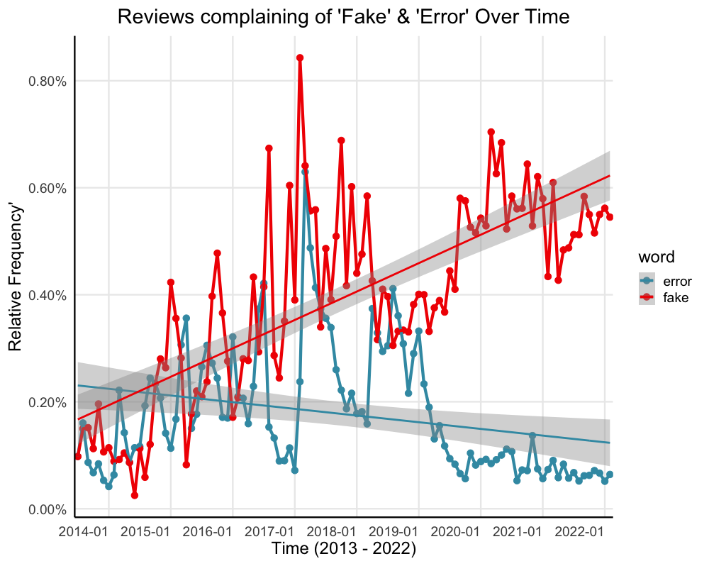

But of course, these are not the only two relevant terms. I next used nearest neighbours word embeddings to gather the top 50 words that are the most semantically similar to ‘fake’ and ‘error’ across the reviews. Here we see words such as ‘spam,’ ‘scambots,’ and ‘phony’ co-occurring frequently with ‘fake;’ we also see ‘failed,’ ‘erorr,’ and ‘oops’ co-occurring frequently with error.  Using this collection of words, I can get a much more robust picture of how these themes were appearing over time in the reviews. 

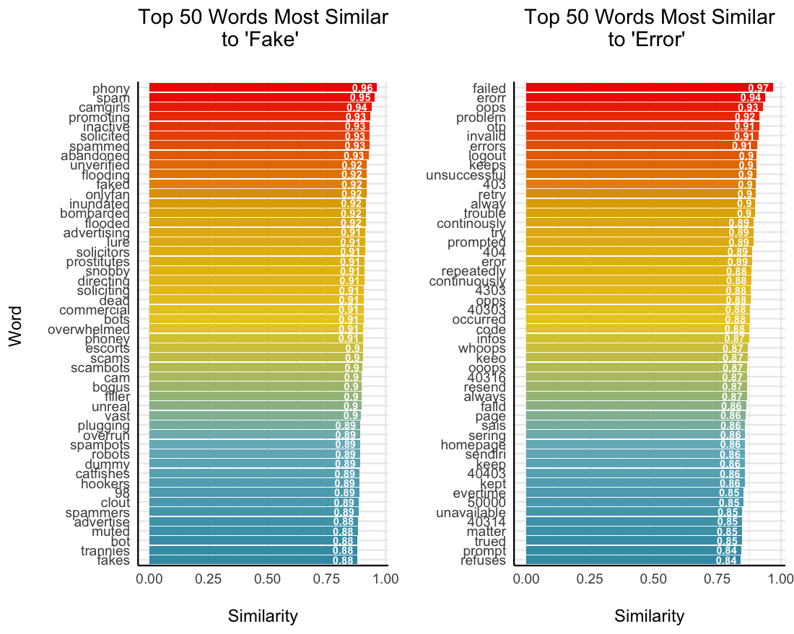

With this more robust approach we see a similar trend. Over the years the app has gotten more stable (<em>ß</em> = -.475, <em>p</em> < .001, 95% CI [-.648, -.302]), but it has also become inundated with complaints of fake profiles (<em>ß</em> = .766, <em>p</em> < .001, 95% CI [.640, .892]). It is important to note here that the frequency of bugs over time is not a linear trend. The number of complaints increases until early 2017, and then begins to decrease. It would be appropriate to analyze this trend wholly with a higher-order (e.g., quadratic, cubic) model.

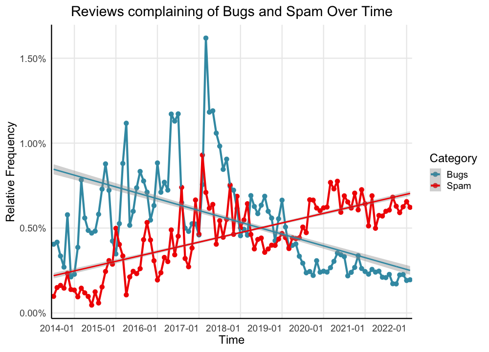

For brevity, I would like to zoom in here and focus on the important phases: the two declines, as defined by the previous breakpoints. Recall that during the initial ratings decline complaints of bugs and spam rose in tandem while during the second ratings decline only complaints of spam rose, while complaints of bugs declined. Based on this I tested two hypotheses:

1.	During the first decline, both complaints of bugs and spam will predict lower ratings
2.	During the second decline, only complaints of spam, not bugs, will predict lower ratings.

To test these hypotheses, I ran a set of two multilevel models—one in each period of decline. Here, a multilevel model accounting for time allows us to model how reports of bugs and spam predict ratings over time. Supporting the first prediction, I found that both reports of bugs and spam predict lower ratings during the first decline. Supporting the second prediction, only reports of spam meaningfully predict lower ratings. It is also worth noting that during the periods of more stagnant ratings, complaints of neither bugs nor spam meaningfully predict decreases in ratings (Betas less than .03).

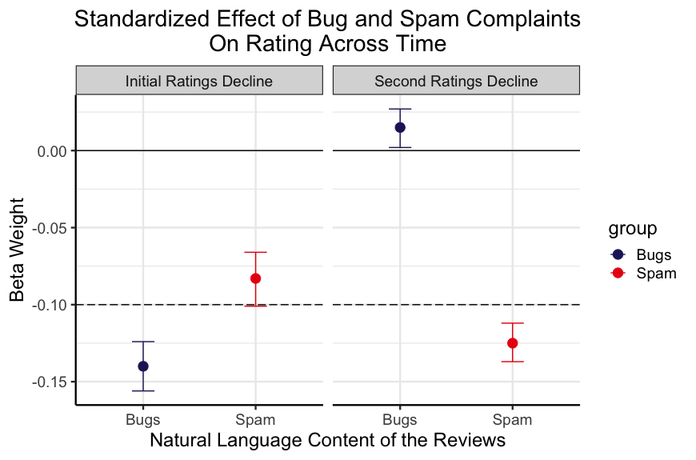

## Limitations

There are two main limitations to address in these analyses. First, the gender of the reviewer is likely related to the content and ratings—especially surrounding fake users. I utilized the ‘gender’ r package to predict user’s gender based off their first names and an estimated birth year of 1990, finding that 77% of the sample (for which a first name could be determined, n = 313,901) was male. It is likely that the identified themes (e.g., fake users) are a complaint more prevalent among female users. Female users likely experience different problems on Tinder (e.g., harassment). Further probing should explore how these trends differ by gender. Secondly, me analysis of positive and negative content, and subsequently the themes of spam and bugs are only one piece impacting ratings. It is quite likely that the review data contain a great deal more nuanced information around users’ experiences on the app (e.g., frustration, harassment, disliked features, etc). Further work should again probe further into the rich natural language left by the users. Finally, I analyzed only the linear trends of the two ratings declines. A more robust version of this analysis would fit a higher order model to understand not only how ratings decline over time, but why the rise as well. It is important to understand what Tinder is doing well, particularly during the recovery phase, to get a more full picture of why ratings fluctuate (as opposed to simply decline) over time.

## Conclusions

In sum, we see that Tinder’s ratings have declined quite substantially between 2013 and 2022. This decline happened in stages with an initial decline, small recovery, secondary decline, and then finally stabilizing. In analyzing the natural language in nearly 600,000 reviews (nearly 7.8 million words), I find that the first decline is predicted by growing complaints of a buggy app and fake users. The second decline, however, is predicted only by the further increase of fake users. This suggests that while Tinder sufficiently stabilized the app’s performance over the years, they still need to address the growing population of fake users in order to reverse this decline in app ratings and, consequently, engagement and user retention.

# Methods
## Changes in Tinder Ratings Over Time
### Change Over Time.

In order to assess whether Tinder ratings were declining over time I ran a standardized linear regression predicting tinder ratings as a function of time on a daily interval. There was no missing data in the original data file. I visually assessed the linearity of the data (residuals vs. fitted plot), homogeneity of variance (scale-location plot), normality of residuals (Q-Q plot), and influential cases (residuals vs. leverage plot). There were no influential cases, and all assumptions aside from the normality of residuals were met. In order to address this assumption violation, I re-ran the model with robust standard errors (See code file). Neither the conclusions, nor the coefficients, changed. Therefore, this analysis was robust to violating the assumption of normality. 

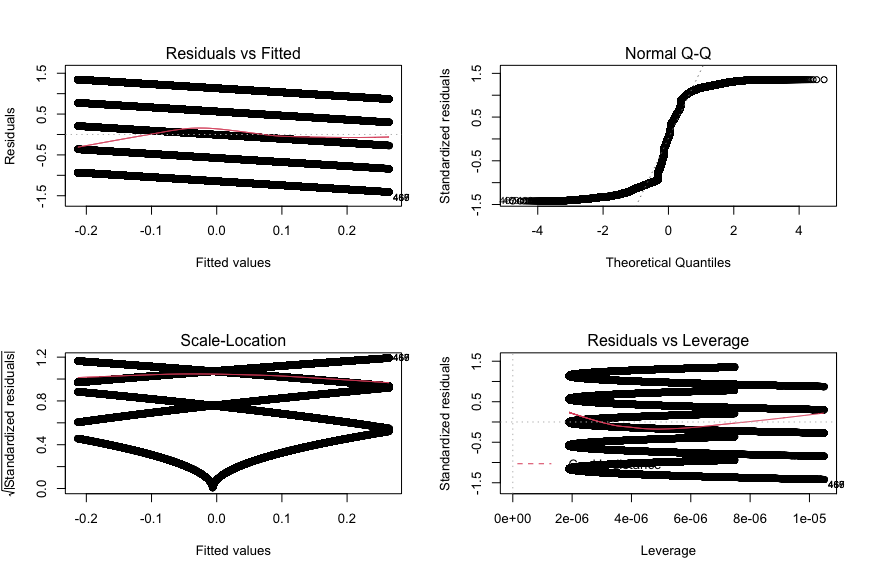

### Determining the Trend Breakpoints. 

I utilized a piecewise linear regression to identify the breakpoints delineating in these trends. I found that tinder ratings declined from July 16, 2013 until September 24, 2015 (n = 87,588 reviews; <em>ß</em> = -.172, <em>p</em> < .001, 95% CI [-.178, -.165]). Secondly, ratings actually increased between September 25, 2015 until October 13, 2018 (n = 192,789 reviews; <em>ß</em> = .110, <em>p</em> < .001, 95% CI [.105, .114]). Third, we observe the second ratings decline between October 14, 2018 until January 13, 2021 (n = 177,910 reviews; <em>ß</em> = -.166, <em>p</em> < .001, 95% CI [-.170, -.161]). Finally, ratings remained relatively flat from January 14, 2021 until February 18, 2022—the end of the data (n = 68,328 reviews; <em>ß</em> = -.012, <em>p</em> < .001, 95% CI [-.020, -.005]).

## Why are Tinder Ratings Changing Over Time?

### Text Pre-Processing. 

As with any analysis of natural language, noisy and uninformative elements need to be removed from the corpus and the text must be cleaned and standardized. In keeping with natural language processing standard practices I cleaned the three in two ways. First, I converted all the text to lowercase. Second, I removed all stopwords from the text using the stopwords function contained in the r package ‘tm.’ Finally, I removed all non-English text. Given that these reviews were global, and left on mobile devices, some reviews contained non-English characters (e.g., East and South Asian alphabets) as well as non-text characters (e.g., Emojis). I removed all non-English non-text characters using the replace_non_ascii function contained in the r package ‘textclean.’ The initial corpus contained 7,830,989 words spread across 526,615 reviews. Following cleaning, I was left with 4,383,647 words spread across 520,929 reviews.

### Computing Emotion Content. 

I conducted a two-stage process to compute the proportions of positive and negative words contained in the cleaned review text. First, I used the polite function contained in the ‘politeness’ package in r to compute positive and negative word frequencies. This package first tokenizes the text into words and then simply counts the number of positive (e.g., great, good, fun) and negative (e.g., bad, boring, terrible) words within each review. Secondly, to account for the increase in overall review content over time I computed the proportion of positive and negative words within each review (i.e., number of positive words / total word count). Thus, controlling for the number of total words, there was more positive content (<em>M</em> = .24, <em>SD</em> = .34) than negative content (<em>M</em> = .08, <em>SD</em> = .17) in the reviews. However, as seen in the main text, over time the increase in negative content outpaced the increase in positive content over time.

### Positive and Negative Content Over Time. 

In order to assess whether positive and negative review content were changing over time I ran two standardized linear regression predicting the proportion of positive and negative emotion content as a function of time on a daily interval. There was no missing data in the original data file. For each model, I visually assessed the linearity of the data (residuals vs. fitted plot), homogeneity of variance (scale-location plot), normality of residuals (Q-Q plot), and influential cases (residuals vs. leverage plot). In both models, there were no influential cases, and all assumptions aside from the normality of residuals were met ([Fig. S1](https://github.com/dwiwad/Tinder_Trends/blob/main/supplemental-images/Fig_S1.Assumptions_Pos_Time.png) and [Fig. S2](https://github.com/dwiwad/Tinder_Trends/blob/main/supplemental-images/Fig_S2.Assumptions_Neg_Time.png)). In order to address this assumption violation, I re-ran the model with robust standard errors (See code file). Neither the conclusions, nor the coefficients, changed. Therefore, this analysis was robust to violating the assumption of normality.

### Computing the Most Frequently Used Negative Words. 

To compute word frequencies, I first tokenized the text of all reviews into individual words (e.g., “I love this app” becomes “I” “love” “this” “app”). Following this I conducted a sentiment analysis on this list of words using the “bing” lexicon. The bing lexicon is a dictionary of words classified in a binary fashion as either positive or negative. Specifically, I classified each word as positive or negative according to how that word is classified in the bing lexicon. I then subsetted the data to contain only negative words (total n = 308,729) and again computed the proportion of each negative word (i.e., total occurrences of each negative word / sum of all negative words) to get the relative frequency of each negative word.

### Usage of ‘Fake’ and ‘Error’ Over Time. 

In order to assess whether the usage of ‘fake’ and ‘error’ were changing over time I ran two standardized linear regression predicting the proportion of these words specifically as a function of time on a daily interval. There was no missing data in the original data file. For each model, I visually assessed the linearity of the data (residuals vs. fitted plot), homogeneity of variance (scale-location plot), normality of residuals (Q-Q plot), and influential cases (residuals vs. leverage plot). As may be intuited from the data, the trends of both ‘fake’ and ‘error’ were not linear over time nor did they conform to the assumption of normality ([Fig. S3](https://github.com/dwiwad/Tinder_Trends/blob/main/supplemental-images/Fig_S3.Assumptions_Fake_Time.png) and [Fig. S4](https://github.com/dwiwad/Tinder_Trends/blob/main/supplemental-images/Fig_S4.Assumptions_Error_Time.png)). Given that this analysis was not the focal analysis, and I am not trying to make claims about these trends predicting ratings decline over the full nine-year period, I will more stringently address the violation of the linearity assumption in the final analysis. Secondarily, to address the violation of normality, I re-ran the model with robust standard errors (See code file). The conclusions do not change, nor do the coefficients change meaningfully. Therefore, this analysis was robust to violating the assumption of normality.

### Using Word Embeddings to Create Themes. 

I next utilized the word2vec package in r to detect words in the reviews that were conceptually related to the target words ‘fake’ and ‘error.’ Specifically, I used a continuous-bag-of-words (CBOW) to compute the cosine similarity of all negative words with each of the target words. I chose this algorithm as it is faster than the alternative approach, skip-grams, which are also better for infrequent words. I trained a word2vec model on the cleaned review text with 15 dimensions over 20 iterations. Following training this model, I used it to predict the top 50 words that were most conceptually similar (i.e., frequently co-occur, had the highest cosine similarity) with the target words in the semantic space. The similarity scores were overall very high to both ‘fake’ (Cosine similarity range .882 to .950) and ‘error’ (Cosine similarity range .846 to .978). Finally, I computed the frequencies of all words conceptually similar to ‘fake’ (i.e., Spam words) and ‘error’ (i.e., Bug words).

### Usage of Spam and Bug Words Over Time. 

In order to assess whether the usage of Spam and Bug words were changing over time I ran two standardized linear regression predicting the proportion of these categories as a function of time on a daily interval. There was no missing data in the original data file. For each model, I visually assessed the linearity of the data (residuals vs. fitted plot), homogeneity of variance (scale-location plot), normality of residuals (Q-Q plot), and influential cases (residuals vs. leverage plot). As may be intuited from the data, the trends of both ‘fake’ and ‘error’ were not linear over time nor did they conform to the assumption of normality ([Fig. S5](https://github.com/dwiwad/Tinder_Trends/blob/main/supplemental-images/Fig_S5.Assumptions_Bugs_Time.png) and [Fig. S6](https://github.com/dwiwad/Tinder_Trends/blob/main/supplemental-images/Fig_S6.Assumptions_Spam_Time.png)). Additionally, there appeared to be heterogeneity of variance in bug words over time. Again, this visually tracks the trend in bugs over time as the app became much more stable in the later years. To address the violations of normality and homoscedasticity, I re-ran the model with robust standard errors (See code file). The conclusions do not change, nor do the coefficients change meaningfully. Therefore, this analysis was robust to violating the assumptions of normality and homoscedasticity.

### Bugs and Spam Predicting Ratings. 

In order to assess whether the usage of Spam and Bug words predicted ratings during the two declines I ran two standardized multilevel models. Specifically, I predicted ratings from the proportion of both Spam and Bug words while including a random intercept of time on a daily interval. There was no missing data in the original data file. In each model I computed Variance Inflation Factors (VIFs) to ensure that there were not issues of multicollinearity. All VIFs were less than 1.9, suggesting that multicollinearity was not a problem in these models. Secondly, I assessed for normality using q-q plots. In each model I found violations of this assumption. Third, I assessed for linearity using the residuals vs. fitted plot finding no violations of this assumption. To address the violations of normality and homoscedasticity, I re-ran the model with robust standard errors (See code file). The conclusions do not change, nor do the coefficients change meaningfully. Therefore, this analysis was robust to violating the assumptions of normality and homoscedasticity.

Finally, I ran two more models during the other phases of ratings change: the recovery phase and final phase. As expected, neither bugs nor spam were particularly important for predicting ratings during these time periods. While all coefficients were statistically significant, no standardized effect sizes were larger than .03. In the recovery phase neither complaints of Bugs (<em>ß</em> = -.023, <em>p</em> < .001, 95% CI [-.035, -.011]) nor Spam (<em>ß</em> = .032, <em>p</em> < .001, 95% CI [.021, .044]) meaningfully predicted ratings over time. Similarly, in the final phase, neither Bugs (<em>ß</em> = .024, <em>p</em> < .001, 95% CI [.011, .037]) nor Spam (<em>ß</em> = .016, <em>p</em> < .001, 95% CI [.004, .029]) meaningfully predicted ratings over time. This final analysis lends more support to the conclusion that these experiences were driving the ratings declines.
